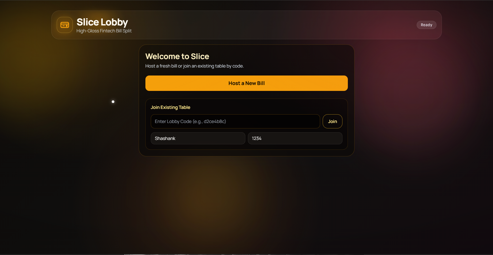
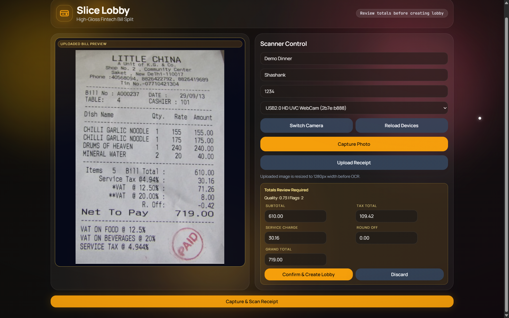
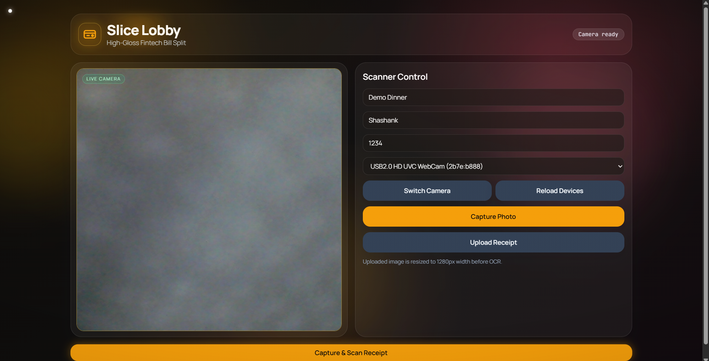
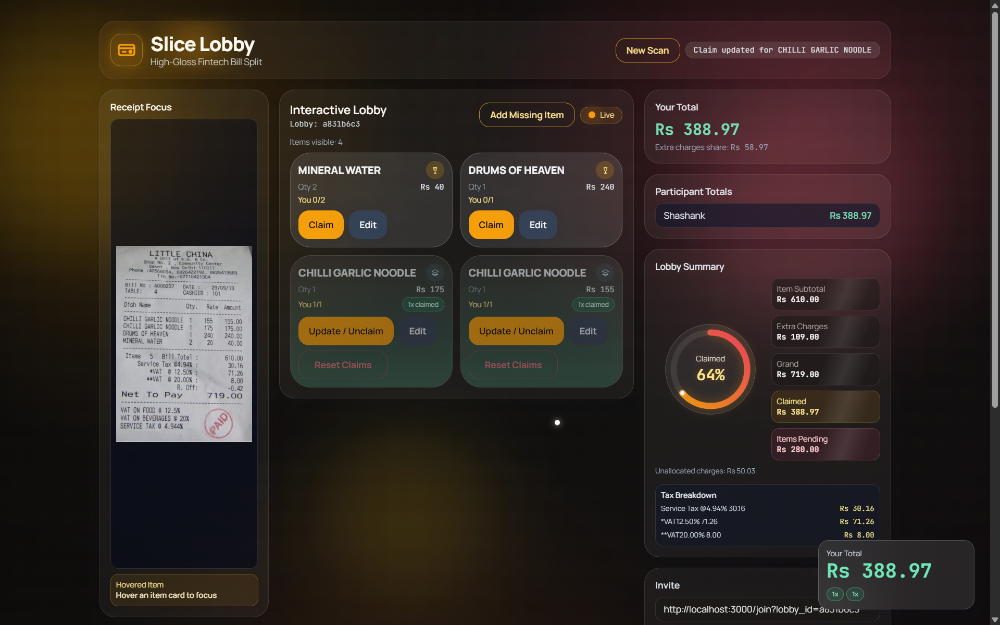
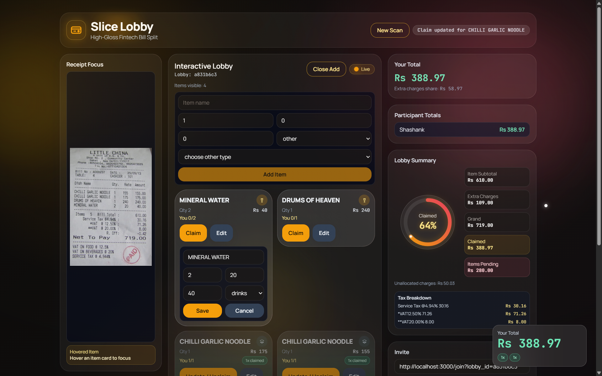
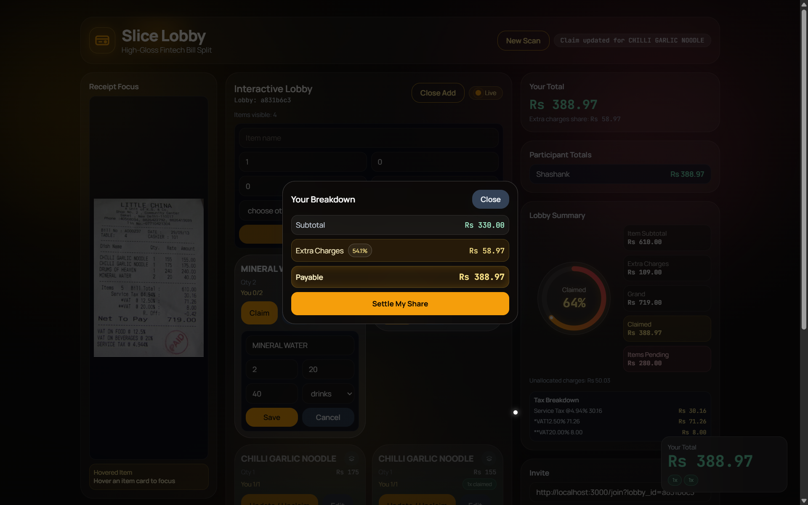
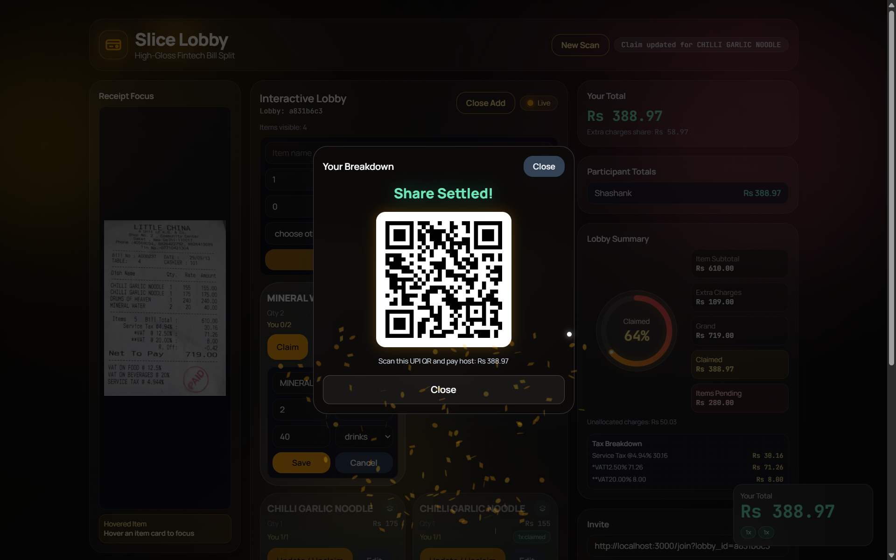

# Slice Lobby

## Aim and Goal

Slice is a bill-splitting app that reads receipt images, extracts line items, and helps a group split costs in a shared lobby.

Main goals:

- reduce manual bill-entry errors
- make group settlement faster
- provide tax-aware and total-aware split summary

How the project addresses this:

- supports hybrid OCR flow (PaddleOCR + Gemini)
- provides lobby-based claim workflow for multiple users
- includes summary logic for totals, taxes, and per-user split
- applies security hardening for deployment (hashed passcodes, CORS allowlist, env-based secrets)

## Project Structure

- `backend/`: FastAPI API (OCR, lobby endpoints, split logic)
- `frontend/`: Next.js app (scan/upload UI, create/join lobby, claim flow)
- `assets/screenshots/`: screenshots shown in this README

## Screenshots









## Prerequisites

Install before running:

- Python `3.10.x` (recommended `3.10.14`)
- Node.js `18+` and npm
- Git

## Run Locally

Use two terminals: one for backend and one for frontend.

### 1. Clone repository

```powershell
git clone https://github.com/shashankachar19/Slice.git
cd Slice
```

### 2. Start backend (Terminal 1)

```powershell
cd backend
python -m venv .venv
.\.venv\Scripts\Activate.ps1
pip install -r requirements.txt
```

Create `backend/.env` using `backend/.env.example` as reference:

```env
GEMINI_API_KEY=your_gemini_api_key_here
GEMINI_MODEL=gemini-1.5-flash
GEMINI_TIMEOUT_SEC=12
CORS_ALLOW_ORIGINS=http://localhost:3000,http://127.0.0.1:3000
PASSCODE_HASH_ITERATIONS=390000
```

Run backend:

```powershell
uvicorn main:app --host 0.0.0.0 --port 8000 --reload
```

Test backend:

- `http://127.0.0.1:8000/health`

### 3. Start frontend (Terminal 2)

```powershell
cd frontend
npm install
```

Create `frontend/.env.local` using `frontend/.env.local.example` as reference:

```env
NEXT_PUBLIC_API_BASE=http://127.0.0.1:8000
NEXT_PUBLIC_SCAN_USE_HYBRID=true
```

Notes:

- set `NEXT_PUBLIC_SCAN_USE_HYBRID=true` to force hybrid OCR locally
- set it to `false` for faster and more stable demo on low-resource hosting

Run frontend:

```powershell
npm run dev
```

Open app:

- `http://localhost:3000`

## If You Change Hotspot or Wi-Fi

Your laptop IP may change. If that happens:

1. Update `NEXT_PUBLIC_API_BASE` in `frontend/.env.local`
2. Add the new frontend origin in `CORS_ALLOW_ORIGINS` in `backend/.env`
3. Restart both backend and frontend servers

## Common Issues

`Failed to fetch`:

- backend not running or sleeping
- wrong `NEXT_PUBLIC_API_BASE`
- CORS not allowing frontend origin

Slow first scan on free hosting:

- cold start delay
- OCR model download on first request
- hybrid mode is heavier than Gemini-only mode
